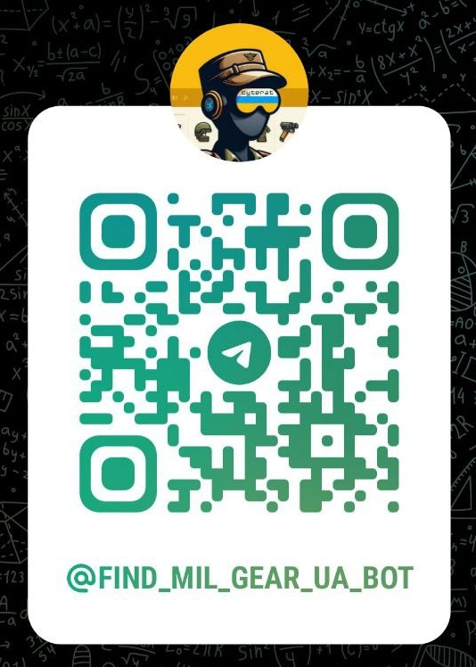
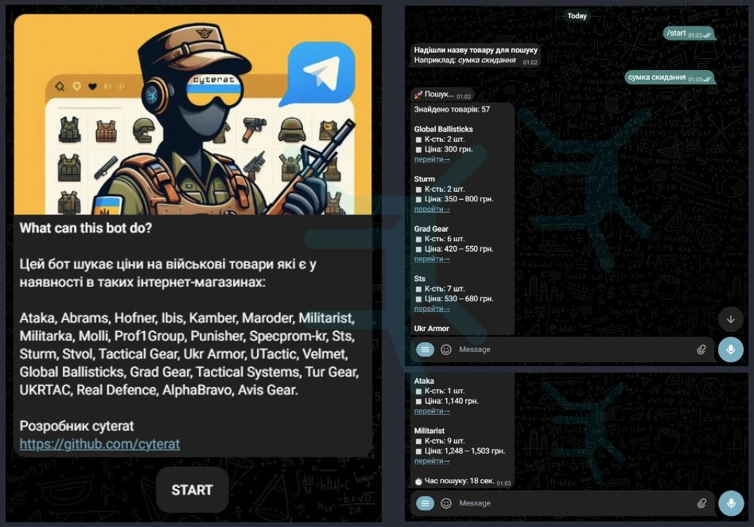
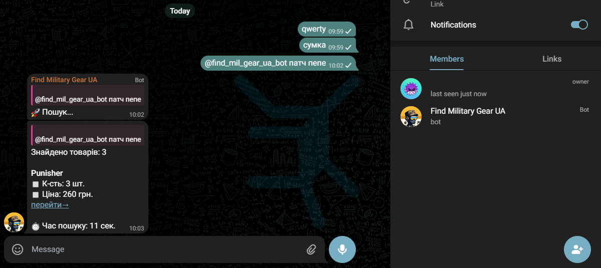
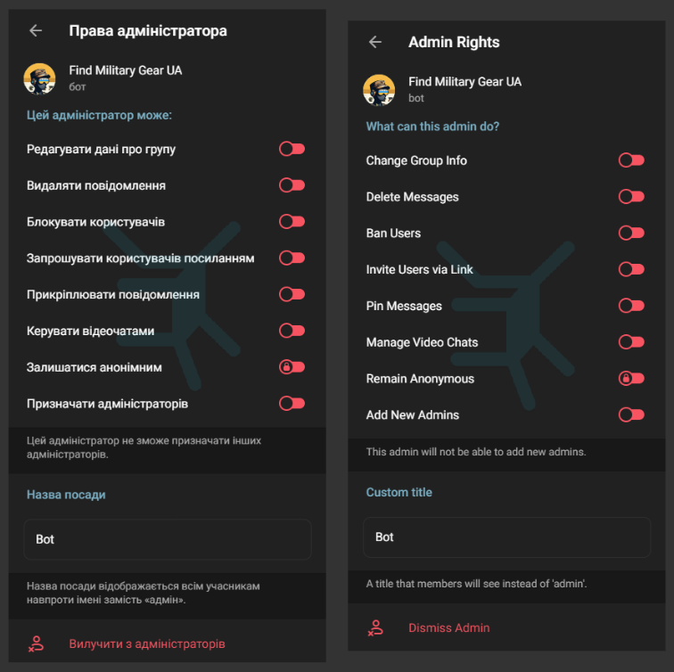
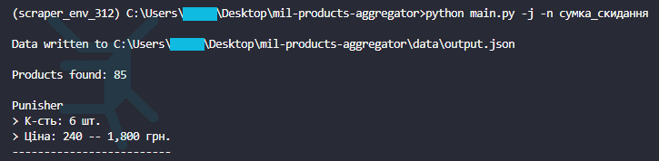
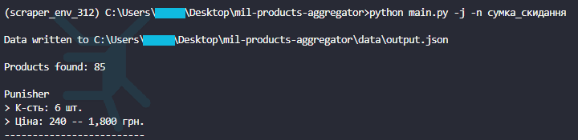

# 🛒 Military Products Aggregator

## 1. Telegram Bot

[@find_mil_gear_ua_bot](https://web.telegram.org/k/#@find_mil_gear_ua_bot) can retrieve a sorted list of prices for the in-stock military clothing, gear, etc. from __27__ online stores.

Currently supported:
[Ataka](https://attack.kiev.ua), [Abrams](https://abrams.com.ua), [Hofner](https://hofner.com.ua), [Ibis](https://ibis.net.ua),
[Kamber](https://kamber.com.ua), [Maroder](https://maroder.com.ua), [Militarist](https://militarist.ua),
[Militarka](https://militarka.com.ua), [Molli](https://molliua.com), [Prof1Group](https://prof1group.ua), [Punisher](https://punisher.com.ua),
[Specprom-kr](https://specprom-kr.com.ua), [Sts](https://sts-gear.com), [Sturm](https://sturm.com.ua), [Stvol](https://stvol.ua),
[Tactical Gear](https://tacticalgear.ua), [Ukr Armor](https://ukrarmor.com.ua), [UTactic](https://utactic.com), [Velmet](https://velmet.ua),
[Global Ballisticks](https://globalballistics.com.ua), [Grad Gear](https://gradgear.com.ua), [Tactical Systems](https://tactical-systems.com.ua),
[Tur Gear](https://turgear.com.ua/), [UKRTAC](https://ukrtac.com/en/), [Real Defence](https://real-def.com), [AlphaBravo](https://alphabravo.com.ua),
[Avis Gear](https://avisgear.com)

The telegram bot has been_built on top of a `scraper.py` script. More information about it below
 

### 1.1 Private chat example

_Note: not all output is visible in the screenshots_

 

### 1.2 Group chat

 

❗ _NOTE: IT NEEDS ADMIN RIGHTS TO WORK IN GROUP CHATS_

## 2. Script

The `scraper.py` script can be used separately from the telegram bot. It is a data scraping and aggregation script for military gear from various Ukrainian online stores. Retrieves discount price (if available) and excludes out-of-stock products.

The script produces a JSON list of dictionaries where each dictionary represents a scraped website.

### 2.1 Output

#### 2.1.1 Terminal output example

Search term: __"сумка скидання"__ (dump pouch)

_Note: not all output is visible in the screenshot_ 
_❗ Important: script has been renamed __~~main.py~~ → scraper.py___

#### 2.1.2 JSON file

Search term: __"сумка скидання"__ (dump pouch)

_Note: only end lines are included in the screenshot_

Example of the format of a single scraped website in `output.json`:

- __website__: str,
- __search_query_url__: str,
- __price_uah_min__: int,
- __price_uah_max__: int,
- __products_qty__: int,
- __social_network__: str,
- __tel_vodafone__: str,
- __tel_kyivstar__: str,
- __details__:
  - __product__: str, __price_uah__: int
  - . . .

## 3. Implemented features

### 3.1 ☑ __asynchronous scraping__

__🚀 Nearly 6x faster!__

Before:

_❗ Important: script has been renamed __~~main.py~~ → scraper.py___

After:

_❗ Important: script has been renamed __~~main.py~~ → scraper.py___

***

### 3.2 ☑ __logging__

Script logs are now stored in the respective '__script_name.log__' file within '__logs__' folder

***

### 3.3 ☑ __command-line interface__

    usage: scraper.py [-h] [-n NAME] [-j] [-v]

    options:
      -h, --help            show this help message and exit
      
      -n NAME, --name NAME  name of the product to scrape
                            (use underscore instead of space between words: сумка_скидання)
      
      -j, --json            write output to JSON file in 'data' folder
      
      -v, --verbose         display data after scraping

_Note: not all output is visible in the screenshot of the CLI use_ 
_❗ Important: script has been renamed __~~main.py~~ → scraper.py___

***

### 3.4 ☑ __telegram bot__

⚡ The telegram bot [@find_mil_gear_ua_bot](https://web.telegram.org/k/#@find_mil_gear_ua_bot) has been built on top of a `scraper.py` script.

## 4. Future ideas

🔥 High priority:

- Add more websites

- ~~Implement async to reduce the overall scraping time~~ ✅

- ~~Implement logging to improve maintainability~~ ✅

- ~~Develop a CLI for the script~~ ✅

 

🌟 Medium priority:

- ~~Create a Telegram Bot~~ ✅

 

✨ Low priority:

- ~~Include searched product page url in `WebsiteScraper`~~ ✅

- Include more phone number fields in `WebsiteScraper`
