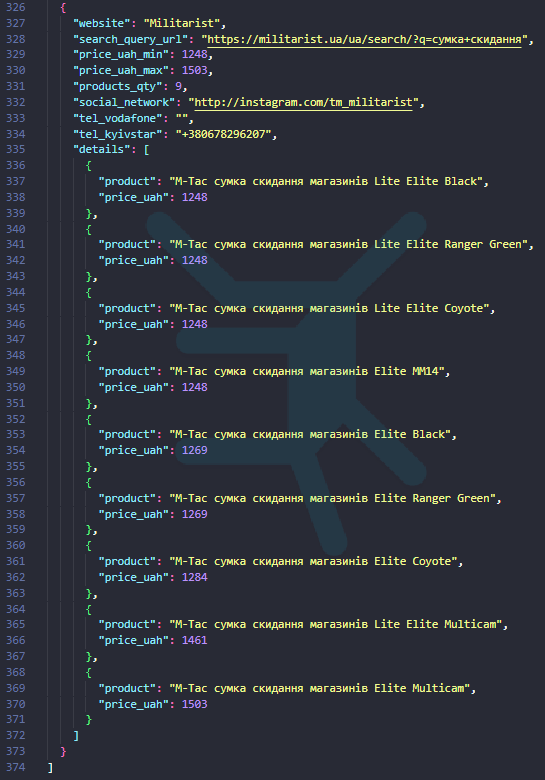
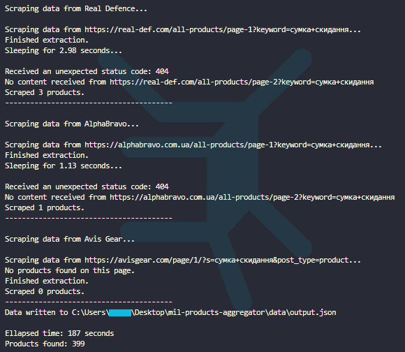
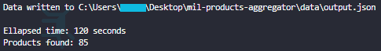
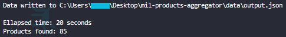

# 🛒 Military Products Aggregator

Data scraping and aggregation script for military gear from various Ukrainian online stores.

Retrieves discount price (if available) and excludes out-of-stock products.

## Script can retrieve product information from __28__ online stores

Currently supported:
[Ataka](https://attack.kiev.ua), [Abrams](https://abrams.com.ua), [Hofner](https://hofner.com.ua), [Ibis](https://ibis.net.ua),
[Kamber](https://kamber.com.ua), [Killa](https://killa.com.ua), [Maroder](https://maroder.com.ua), [Militarist](https://militarist.ua),
[Militarka](https://militarka.com.ua), [Molli](https://molliua.com), [Prof1Group](https://prof1group.ua), [Punisher](https://punisher.com.ua),
[Specprom-kr](https://specprom-kr.com.ua), [Sts](https://sts-gear.com), [Sturm](https://sturm.com.ua), [Stvol](https://stvol.ua),
[Tactical Gear](https://tacticalgear.ua), [Ukrarmor](https://ukrarmor.com.ua), [Utactic](https://utactic.com), [Velmet](https://velmet.ua),
[Global Ballisticks](https://globalballistics.com.ua), [Grad Gear](https://gradgear.com.ua), [Tactical Systems](https://tactical-systems.com.ua),
[Tur Gear](https://turgear.com.ua/), [UKRTAC](https://ukrtac.com/en/), [Real Defence](https://real-def.com), [AlphaBravo](https://alphabravo.com.ua),
[Avis Gear](https://avisgear.com)

## Script output

### JSON file format

_Note: the `main.py` script produces a JSON list of dictionaries where each dictionary represents a scraped website._

Example of the format of a single scraped website in `output.json`:

- __website__: str,
- __price_uah_min__: int,
- __price_uah_max__: int,
- __products_qty__: int,
- __social_network__: str,
- __tel_vodafone__: str,
- __tel_kyivstar__: str,
- __details__:
  - __product__: str, __price_uah__: int
  - __product__: str, __price_uah__: int
  - . . .

### JSON file example

Search term: __"сумка скидання"__ (dump pouch)

### Terminal output example

Search term: __"сумка скидання"__ (dump pouch)

_Note: only end lines are included in the screenshot_

***

## ✅ Implemented asynchronous scraping

__🚀 Nearly 6x faster scraping!__

Before:

After:

***

## Future ideas

- Add more websites
- Include websites and products urls in `output.json`
- Include more phone number fields in `output.json`
- ~~Implement async to reduce the overall scraping time~~
