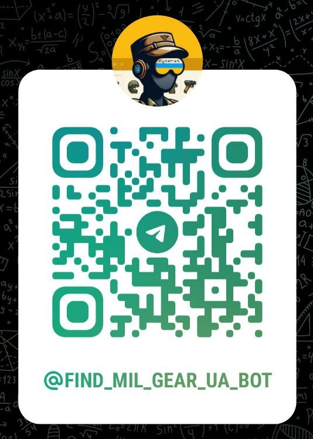
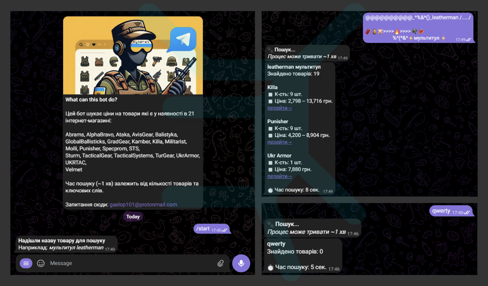
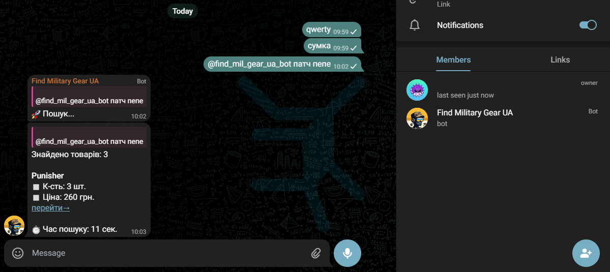
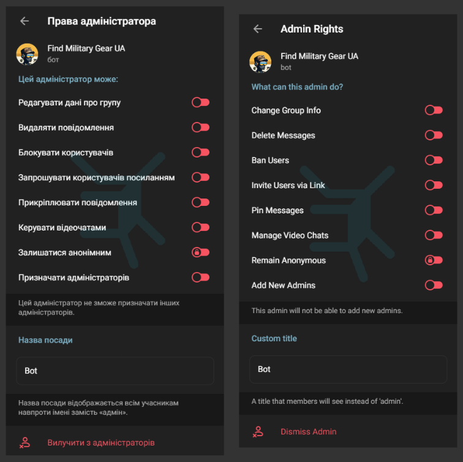
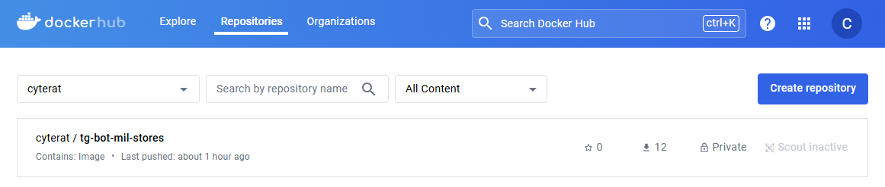
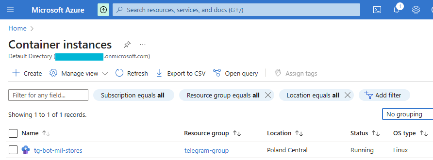

# 🛒 Military Products Scraper Bot

## 1. Telegram Bot Description

The telegram bot has been_built on top of a `scraper.py` script from my other project.
It is currently deployed in Azure Container Instances using its Docker image in Docker Hub private repo.

[@find_mil_gear_ua_bot](https://web.telegram.org/k/#@find_mil_gear_ua_bot) can retrieve a sorted list of prices for the in-stock military clothing, gear, etc. from __21__ online stores.

Currently supported:
[Abrams](https://abrams.com.ua),
[AlphaBravo](https://alphabravo.com.ua),
[Ataka](https://attack.kiev.ua),
[Avis Gear](https://avisgear.com),
[Balistyka](https://globalballistics.com.ua),
[Global Ballisticks](https://globalballistics.com.ua),
[Grad Gear](https://gradgear.com.ua),
[Kamber](https://kamber.com.ua),
[Killa](https://killa.com.ua),
[Militarist](https://militarist.ua),
[Molli](https://molliua.com),
[Punisher](https://punisher.com.ua),
[Specprom-kr](https://specprom-kr.com.ua),
[Sts](https://sts-gear.com),
[Sturm](https://sturm.com.ua),
[Tactical Gear](https://tacticalgear.ua),
[Tactical Systems](https://tactical-systems.com.ua),
[Tur Gear](https://turgear.com.ua/),
[Ukr Armor](https://ukrarmor.com.ua),
[UKRTAC](https://ukrtac.com/en/),
[Velmet](https://velmet.ua)
 

Private chat example  

Group chat example  

❗ _NOTE: THE BOT NEEDS ADMIN RIGHTS TO WORK IN GROUP CHATS, All other permissions can be disabled as shown below_

## 2. Updates

### ✅ __creating docker image of a telegram bot__

The telegram bot image has been published in a private repository on Docker Hub.

The docker repo with the telegram bot image 

### ✅ __deploying bot in cloud__

The telegram bot container has been deployed in __'Azure Container Instance'__ to ensure it is live 24/7.

The telegram bot in Azure Container Instance 

## 3. Reminders

- Add more websites & maintain existing ones

- ~~Implement async to reduce the overall scraping time~~ ✅

- ~~Develop a CLI for the scraping script~~ ✅

- ~~Include searched product page url in `WebsiteScraper`~~ ✅

- ~~Create a docker container with a bot~~ ✅

- ~~Deploy telegram bot on cloud platform~~ ✅
