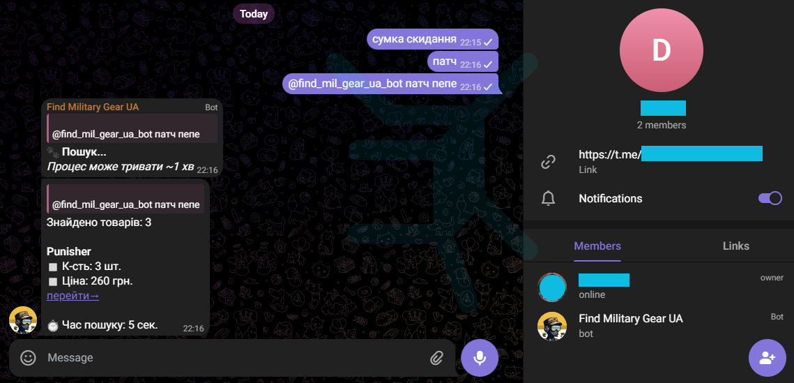

# 🛒 Military Products Aggregator

## Telegram Bot

The telegram bot has been_built on top of a `scraper.py` script from my other project.

[@find_mil_gear_ua_bot](https://web.telegram.org/k/#@find_mil_gear_ua_bot) can retrieve a sorted list of prices for the in-stock military clothing, gear, etc. from __26__ online stores.

Currently supported:
[Abrams](https://abrams.com.ua), [AlphaBravo](https://alphabravo.com.ua), [Ataka](https://attack.kiev.ua), [Avis Gear](https://avisgear.com),
[Balistyka](https://globalballistics.com.ua), [Global Ballisticks](https://globalballistics.com.ua), [Grad Gear](https://gradgear.com.ua),
[Ibis](https://ibis.net.ua), [Kamber](https://kamber.com.ua), [Killa](https://killa.com.ua), [Militarist](https://militarist.ua),
[Militarka](https://militarka.com.ua), [Molli](https://molliua.com), [Punisher](https://punisher.com.ua),
[Real Defence](https://real-def.com), [Specprom-kr](https://specprom-kr.com.ua), [Sts](https://sts-gear.com), [Sturm](https://sturm.com.ua),
[Stvol](https://stvol.ua), [Tactical Gear](https://tacticalgear.ua), [Tactical Systems](https://tactical-systems.com.ua), [Tur Gear](https://turgear.com.ua/),
[Ukr Armor](https://ukrarmor.com.ua), [UKRTAC](https://ukrtac.com/en/), [UTactic](https://utactic.com), [Velmet](https://velmet.ua),
 

### Private chat example

 

### Group chat

 

❗ _NOTE: THE BOT NEEDS ADMIN RIGHTS TO WORK IN GROUP CHATS, All other permissions can be disabled as shown below_

### ☑ __containerized telegram bot__

  The docker container with the telegram bot 

## 🔥 Reminders

- Add more websites

- ~~Implement async to reduce the overall scraping time~~ ✅

- ~~Develop a CLI for the scraping script~~ ✅

- ~~Include searched product page url in `WebsiteScraper`~~ ✅

- ~~Create a docker container with a bot~~ ✅

- Deploy telegram bot on cloud platform
